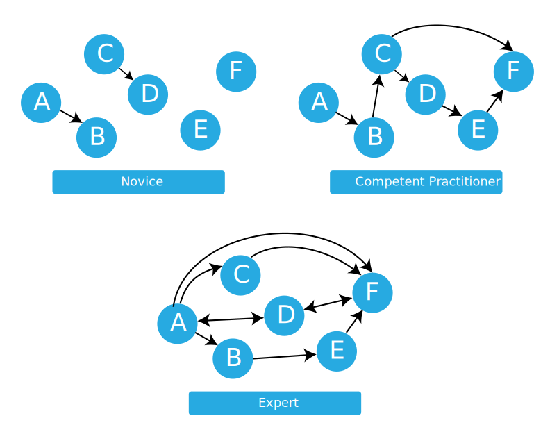

% How learning works
% Gerard Capes

# How learning works
This section is about how learning works, based on educational research.

# Carpentries pedagogical model
- Carpentries teach computational competance to learners
- Applied approach: specific, practical examples
	- Allows hands-on pracice, building confidence and laying foundation for future learning
	- Real time practice and feedback
	- Two-way feedback allows instructors to adjust pace and content, and improves lesson materials

# Acquisition of skill

::: notes

- Novice - don't know what they don't know
- Competent practitioner - can do normal tasks, in normal time with normal effort
- Expert - can handle situations out of the ordinary

- Instructors more likely to be competent practitioners or experts - carpentries audience mostly novices.
- So how can we distinguish between novices and competent practitioners?

:::

# Development of mental models
- Effective learning happens when the learner creates a mental model of the domain.
- Mental model is a collection of facts and concepts, 
  along with their relationships.
  - US resident example.
- Novice doesn't have a mental model of the domain.
- They therefore reason by analogy and mental models of other domains.
- Competent practitioner has a good-enough mental model for everyday purposes.
- Experts have many more linkages between concepts - discussed in more depth later.

---

---

# Teaching novices
- Research shows each stage of skill needs to be taught differently.
- Presenting novices with a pile of facts early on doesn't work 
  because they need a mental model to fit them into.
- Our aim is to help novices to build a mental model, 
  so how to think about programming,
  so they can learn more on their own.

# Importance of going slowly
> If someone feels it’s too slow, they’ll be a bit bored. 
> If they feel it’s too fast, they’ll never come back to programming. 

- The material is designed to focus on building mental models,
  and avoids overloading learners with unrelated facts.
- Adjust our teaching to their skill level, *without making them feel inferior*
  about their current practices or skill set.
- Meeting learners where they are is one of the strengths of Carpentry workshops.
- We teach relevant and useful skills in an inclusive environment,
  and continually request and respond to feedback from learners.

# How 'knowledge' gets in the way
- In addition to going slowly,
  we need to address the misconceptions of broken mental models
  in order to build better ones.
- Mental models are hardly ever built from scratch --
  learners have some information, ideas and opinions on a topic.
- Often, this prior knowledge is incomplete or inaccurate,
  which makes it difficult to incorporate new, correct information into their
  mental model.

So fixing misconceptions is as important as presenting correct information.

# Misconceptions
- Simple factual errors: easiest to correct
- Broken models: correct by reasoning (our focus)
- Fundamental beliefs: can't really address

---

## Identifying and correcting misconceptions
- In order to expose misconceptions, in order to address them,
  instructors need feedback on learners' mental models.
- This comes from *formative assessment*.
- Summative assessment is pass/fail e.g. driving test.
- Formative assessment is a feedback mechanism, not a pass/fail.
- Allows learners to focus their study effort, 
  and instructors to respond to challenges learners are facing.

- Repetition vs reflective practice:
  - 10,000 hours practice -> expert ... but only with feedback.
  - Hence we emphasise practice and feedback in workshops.

# Formative assessments
- e.g. MCQ
- Each incorrect answer should be a plausible distractor with diagnostic power

- What is 27 + 15?
  1. 42
  2. 32
  3. 312
  4. 33

- Choose one wrong answer and explain the misconception associated with it.

::: notes

- If the child answers 32, they are throwing away the carry completely.
- If they answer 312, they know that they can’t just discard the carried ‘1’,
  but doesn’t understand that it’s actually a ten and needs to be added into the next column.
  In other words, they are treating each column of numbers as unconnected to its neighbours.
- If they answer 33 then they know they have to carry the 1,
  but are carrying it back into the same column it came from.

:::

# Exercise
- Take 10 minutes to create a multiple choice question related to a topic you intend to teach. 
- Type it into the Etherpad and explain the diagnostic power of each its distractors,
  i.e., what misconception is each distractor meant to identify?

# Formative Assessments Should Be Frequent
1. Teach some stuff
2. Present MCQ probing for misconceptions
3. Students answer a MCQ 

- Do it frequently - e.g every 15 mins or so
- Can be done preemptively
- Break-up teaching and re-focus attention

Learners are commonly far too satisfied to *not* understand key points and remain confused.

# Notes on MCQ design
- A good MCQ tests for conceptual misunderstanding, not factual knowledge
- For distractors, think about problems from previous training events
- MCQs are useful even if not used in class -- instructor thinks about learners' mental models.

# Key points
- Our goal when teaching novices is to help them construct useful mental models.
- This requires practice and feedback.
- Formative assessments provide practice for learners and feedback to learners and instructors.

